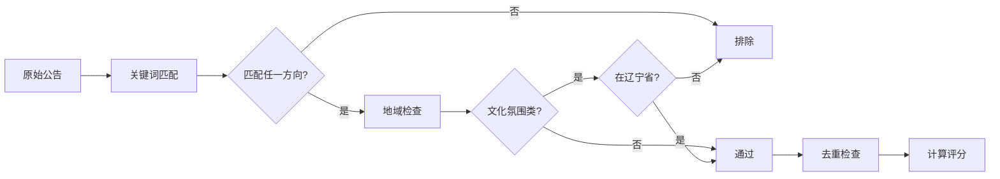

# 招标项目筛选规范

## 业务方向配置

### 4 个核心方向

| 方向 | 关键词 | 地域限制 |
|------|--------|---------|
| 文化氛围类 | 文化、氛围、墙、宣传 | **辽宁省优先，大连市最佳** |
| 数字史馆类 | 数字史馆、数字展馆 | 无限制 |
| 仿真训练系统类 | VR、AR、仿真、虚拟、模拟 | 无限制 |
| 院线电影服务类 | 电影、院线、影院 | 无限制 |

**重要**：只有文化氛围类对地域有硬性要求！

## 筛选流程



## 关键词匹配实现

### 1. 基础匹配器

```python
class KeywordMatcher:
    def __init__(self, config):
        self.directions = config['business_directions']
    
    def match(self, announcement):
        """匹配业务方向"""
        title = announcement['title']
        content = announcement.get('content', '')
        text = f"{title} {content}"
        
        results = {}
        for direction_id, direction in self.directions.items():
            score = self._calculate_score(text, direction)
            if score > 0:
                results[direction_id] = {
                    'name': direction['name'],
                    'score': score,
                    'matched_keywords': self._find_matched_keywords(text, direction)
                }
        
        return results
    
    def _calculate_score(self, text, direction):
        """计算匹配分数"""
        keywords = direction['keywords_include']
        matches = sum(1 for kw in keywords if kw in text)
        return matches / len(keywords) if keywords else 0
```

### 2. 地域匹配器（仅文化氛围类）

```python
class LocationMatcher:
    PROVINCES = ['辽宁省', '辽宁']
    CITIES = ['大连市', '大连']
    
    def match(self, announcement, direction_id):
        """检查地域匹配"""
        # 只有文化氛围类需要地域检查
        if direction_id != 'cultural_atmosphere':
            return {'required': False, 'matched': True, 'score': 1.0}
        
        text = f"{announcement['title']} {announcement.get('location', '')}"
        
        # 检查是否在辽宁省
        in_province = any(p in text for p in self.PROVINCES)
        in_city = any(c in text for c in self.CITIES)
        
        if not in_province:
            return {'required': True, 'matched': False, 'score': 0}
        
        # 大连市加分
        score = 1.2 if in_city else 1.0
        
        return {
            'required': True,
            'matched': True,
            'score': score,
            'province': in_province,
            'city': in_city
        }
```

## 去重策略

### 1. 基于标题和日期

```python
class Deduplicator:
    def __init__(self, db):
        self.db = db
    
    def is_duplicate(self, announcement):
        """检查是否重复"""
        # 生成唯一标识
        unique_id = self._generate_id(announcement)
        
        # 查询数据库
        return self.db.exists(unique_id)
    
    def _generate_id(self, announcement):
        """生成唯一 ID"""
        import hashlib
        text = f"{announcement['title']}_{announcement['pub_date']}"
        return hashlib.md5(text.encode()).hexdigest()
```

## 排除规则

### 全局排除关键词

```python
EXCLUDE_KEYWORDS = [
    '保密资质',
    '涉密',
    '秘密级',
    '机密级'
]

def should_exclude(announcement):
    """检查是否应排除"""
    text = f"{announcement['title']} {announcement.get('content', '')}"
    return any(kw in text for kw in EXCLUDE_KEYWORDS)
```

## 可行性评分

### 综合评分算法

```python
class FeasibilityScorer:
    def calculate(self, announcement, match_results):
        """计算可行性评分（0-100）"""
        scores = {
            'keyword_match': 0,      # 关键词匹配度 (0-40)
            'location_match': 0,     # 地域匹配度 (0-30)
            'deadline_urgency': 0    # 截止时间紧急度 (0-30)
        }
        
        # 1. 关键词匹配分（最高 40 分）
        best_match = max(match_results.values(), key=lambda x: x['score'])
        scores['keyword_match'] = best_match['score'] * 40
        
        # 2. 地域匹配分（最高 30 分）
        location = match_results.get('location', {})
        if location.get('matched', False):
            scores['location_match'] = location.get('score', 1.0) * 30
        
        # 3. 截止时间分（最高 30 分）
        days_left = self._calculate_days_left(announcement.get('deadline'))
        if days_left >= 7:
            scores['deadline_urgency'] = 30
        elif days_left >= 3:
            scores['deadline_urgency'] = 20
        elif days_left >= 1:
            scores['deadline_urgency'] = 10
        else:
            scores['deadline_urgency'] = 0
        
        total = sum(scores.values())
        return {
            'total': round(total, 2),
            'breakdown': scores,
            'level': self._get_level(total)
        }
    
    def _get_level(self, score):
        """评分等级"""
        if score >= 80:
            return '高度推荐'
        elif score >= 60:
            return '推荐'
        elif score >= 40:
            return '可考虑'
        else:
            return '不推荐'
```

## 筛选结果格式

```python
{
    'announcement': {...},           # 原始公告数据
    'matched_directions': [          # 匹配的业务方向
        {
            'id': 'cultural_atmosphere',
            'name': '文化氛围类',
            'keyword_score': 0.75,
            'matched_keywords': ['文化', '宣传'],
            'location_matched': True,
            'location_score': 1.2
        }
    ],
    'feasibility': {
        'total': 85.5,
        'breakdown': {
            'keyword_match': 30,
            'location_match': 36,
            'deadline_urgency': 19.5
        },
        'level': '高度推荐'
    },
    'excluded': False,
    'duplicate': False,
    'filtered_at': '2026-02-04 14:30:00'
}
```

## 使用示例

```python
from loguru import logger

def filter_announcements(announcements, config):
    """筛选公告"""
    matcher = KeywordMatcher(config)
    location_matcher = LocationMatcher()
    deduplicator = Deduplicator(db)
    scorer = FeasibilityScorer()
    
    filtered = []
    
    for ann in announcements:
        # 1. 排除检查
        if should_exclude(ann):
            logger.warning(f"⚠️ 排除（保密资质）: {ann['title']}")
            continue
        
        # 2. 关键词匹配
        match_results = matcher.match(ann)
        if not match_results:
            logger.info(f"ℹ️ 跳过（不匹配）: {ann['title']}")
            continue
        
        # 3. 地域检查
        best_direction = max(match_results.keys(), key=lambda k: match_results[k]['score'])
        location_result = location_matcher.match(ann, best_direction)
        
        if not location_result['matched']:
            logger.warning(f"⚠️ 排除（地域不符）: {ann['title']}")
            continue
        
        # 4. 去重检查
        if deduplicator.is_duplicate(ann):
            logger.info(f"ℹ️ 跳过（重复）: {ann['title']}")
            continue
        
        # 5. 计算评分
        feasibility = scorer.calculate(ann, match_results)
        
        result = {
            'announcement': ann,
            'matched_directions': list(match_results.values()),
            'feasibility': feasibility
        }
        
        filtered.append(result)
        logger.success(f"✅ 通过筛选: {ann['title']} (评分: {feasibility['total']})")
    
    return filtered
```

## 配置文件读取

从 `config/business_directions.yaml` 读取配置，支持动态调整关键词和权重。
