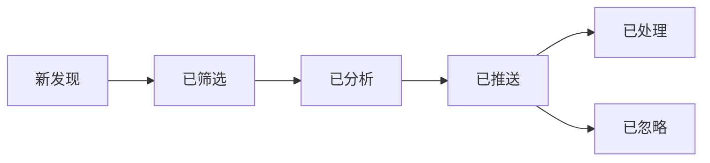

# 招标项目工作流程管理

## 项目生命周期

### 状态流转图



### 状态定义

| 状态 | 说明 | 触发条件 |
|------|------|---------|
| 新发现 | 爬虫刚抓取到的公告 | 爬虫完成 |
| 已筛选 | 通过关键词和地域筛选 | 筛选器验证通过 |
| 已分析 | AI 提取了关键信息 | 分析器完成 |
| 已推送 | 报告已推送到通知渠道 | 通知器发送成功 |
| 已处理 | 人工标记为已跟进 | 手动更新 |
| 已忽略 | 人工标记为不感兴趣 | 手动更新 |

## 数据库表结构

### announcements 表

```sql
CREATE TABLE announcements (
    id TEXT PRIMARY KEY,
    title TEXT NOT NULL,
    content TEXT,
    pub_date DATE,
    url TEXT UNIQUE,
    location TEXT,
    budget TEXT,
    deadline DATETIME,
    contact TEXT,
    attachments TEXT,  -- JSON 格式
    status TEXT DEFAULT 'discovered',
    created_at DATETIME DEFAULT CURRENT_TIMESTAMP,
    updated_at DATETIME DEFAULT CURRENT_TIMESTAMP
);
```

### filtered_projects 表

```sql
CREATE TABLE filtered_projects (
    id INTEGER PRIMARY KEY AUTOINCREMENT,
    announcement_id TEXT,
    matched_directions TEXT,  -- JSON 格式
    feasibility_score REAL,
    feasibility_level TEXT,
    status TEXT DEFAULT 'filtered',
    filtered_at DATETIME DEFAULT CURRENT_TIMESTAMP,
    FOREIGN KEY (announcement_id) REFERENCES announcements(id)
);
```

### analysis_results 表

```sql
CREATE TABLE analysis_results (
    id INTEGER PRIMARY KEY AUTOINCREMENT,
    announcement_id TEXT,
    extracted_info TEXT,  -- JSON 格式
    confidence_score REAL,
    analyzed_at DATETIME DEFAULT CURRENT_TIMESTAMP,
    FOREIGN KEY (announcement_id) REFERENCES announcements(id)
);
```

### notification_logs 表

```sql
CREATE TABLE notification_logs (
    id INTEGER PRIMARY KEY AUTOINCREMENT,
    announcement_id TEXT,
    channel TEXT,  -- wechat_work, email, wechat
    status TEXT,   -- success, failed
    sent_at DATETIME DEFAULT CURRENT_TIMESTAMP,
    error_message TEXT,
    FOREIGN KEY (announcement_id) REFERENCES announcements(id)
);
```

### task_logs 表（定时任务执行记录）

```sql
CREATE TABLE task_logs (
    id INTEGER PRIMARY KEY AUTOINCREMENT,
    task_name TEXT,
    status TEXT,  -- success, failed
    start_time DATETIME,
    end_time DATETIME,
    duration_seconds REAL,
    crawled_count INTEGER,
    matched_count INTEGER,
    error_message TEXT
);
```

## 定时任务配置

### APScheduler 实现

```python
from apscheduler.schedulers.blocking import BlockingScheduler
from apscheduler.triggers.cron import CronTrigger
from loguru import logger
import pytz

class TaskScheduler:
    def __init__(self, config):
        self.scheduler = BlockingScheduler(
            timezone=pytz.timezone(config.get('timezone', 'Asia/Shanghai'))
        )
        self.config = config
    
    def add_daily_tasks(self):
        """添加每日4次定时任务"""
        times = self.config.get('times', ['09:00', '11:55', '13:00', '17:55'])
        
        for time_str in times:
            hour, minute = map(int, time_str.split(':'))
            
            self.scheduler.add_job(
                func=self.run_tender_pipeline,
                trigger=CronTrigger(hour=hour, minute=minute),
                id=f'daily_task_{time_str}',
                name=f'每日招标爬取任务 {time_str}',
                replace_existing=True
            )
            logger.info(f"✅ 已添加定时任务: 每天 {time_str}")
    
    def run_tender_pipeline(self):
        """执行完整流程"""
        task_id = datetime.now().strftime('%Y%m%d%H%M%S')
        logger.info(f"🚀 开始执行任务: {task_id}")
        
        start_time = time.time()
        
        try:
            # 1. 爬取
            announcements = spider.fetch_announcements()
            logger.info(f"📥 爬取到 {len(announcements)} 条公告")
            
            # 2. 筛选
            filtered = filter_announcements(announcements)
            logger.info(f"🔍 筛选出 {len(filtered)} 个匹配项目")
            
            # 3. 分析
            analyzed = []
            for project in filtered:
                result = analyzer.analyze(project['announcement'])
                project['analysis'] = result
                analyzed.append(project)
            logger.info(f"🤖 完成 {len(analyzed)} 个项目分析")
            
            # 4. 生成报告
            stats = {
                'total_crawled': len(announcements),
                'total_matched': len(filtered),
                'high_priority': sum(1 for p in filtered if p['feasibility']['total'] >= 80),
                'medium_priority': sum(1 for p in filtered if 60 <= p['feasibility']['total'] < 80),
                'low_priority': sum(1 for p in filtered if p['feasibility']['total'] < 60)
            }
            report = reporter.generate_daily_report(analyzed, stats)
            
            # 5. 推送通知
            notifier.send_all(report, analyzed)
            logger.info(f"📤 报告推送完成")
            
            # 6. 记录日志
            duration = time.time() - start_time
            self._log_task_success(task_id, duration, stats)
            
            logger.success(f"✅ 任务完成: {task_id} (耗时: {duration:.2f}秒)")
            
        except Exception as e:
            duration = time.time() - start_time
            logger.error(f"❌ 任务失败: {task_id} - {e}")
            self._log_task_failure(task_id, duration, str(e))
    
    def _log_task_success(self, task_id, duration, stats):
        """记录成功日志"""
        db.execute("""
            INSERT INTO task_logs 
            (task_name, status, start_time, end_time, duration_seconds, crawled_count, matched_count)
            VALUES (?, 'success', ?, ?, ?, ?, ?)
        """, (
            task_id,
            datetime.now() - timedelta(seconds=duration),
            datetime.now(),
            duration,
            stats['total_crawled'],
            stats['total_matched']
        ))
    
    def _log_task_failure(self, task_id, duration, error):
        """记录失败日志"""
        db.execute("""
            INSERT INTO task_logs 
            (task_name, status, start_time, end_time, duration_seconds, error_message)
            VALUES (?, 'failed', ?, ?, ?, ?)
        """, (
            task_id,
            datetime.now() - timedelta(seconds=duration),
            datetime.now(),
            duration,
            error
        ))
    
    def start(self):
        """启动调度器"""
        logger.info("🚀 定时任务调度器启动")
        self.scheduler.start()
```

## 历史记录查询

### 查询接口

```python
class HistoryQuery:
    def __init__(self, db):
        self.db = db
    
    def get_recent_projects(self, days=7, status=None):
        """查询最近N天的项目"""
        query = """
            SELECT a.*, f.feasibility_score, f.feasibility_level
            FROM announcements a
            LEFT JOIN filtered_projects f ON a.id = f.announcement_id
            WHERE a.created_at >= datetime('now', '-{} days')
        """.format(days)
        
        if status:
            query += f" AND a.status = '{status}'"
        
        query += " ORDER BY a.created_at DESC"
        
        return self.db.query(query)
    
    def get_by_direction(self, direction, days=30):
        """按业务方向查询"""
        query = """
            SELECT a.*, f.matched_directions, f.feasibility_score
            FROM announcements a
            JOIN filtered_projects f ON a.id = f.announcement_id
            WHERE f.matched_directions LIKE ?
            AND a.created_at >= datetime('now', '-{} days')
            ORDER BY f.feasibility_score DESC
        """.format(days)
        
        return self.db.query(query, (f'%{direction}%',))
    
    def get_statistics(self, start_date, end_date):
        """统计分析"""
        stats = {}
        
        # 爬取总数
        stats['total_crawled'] = self.db.query_scalar("""
            SELECT COUNT(*) FROM announcements
            WHERE created_at BETWEEN ? AND ?
        """, (start_date, end_date))
        
        # 匹配总数
        stats['total_matched'] = self.db.query_scalar("""
            SELECT COUNT(*) FROM filtered_projects
            WHERE filtered_at BETWEEN ? AND ?
        """, (start_date, end_date))
        
        # 各方向分布
        stats['direction_distribution'] = self.db.query("""
            SELECT matched_directions, COUNT(*) as count
            FROM filtered_projects
            WHERE filtered_at BETWEEN ? AND ?
            GROUP BY matched_directions
        """, (start_date, end_date))
        
        return stats
```

## 异常告警

### 告警规则

```python
class AlertManager:
    def check_and_alert(self):
        """检查异常并告警"""
        alerts = []
        
        # 1. 检查爬虫失败率
        recent_tasks = db.query("""
            SELECT status, COUNT(*) as count
            FROM task_logs
            WHERE start_time >= datetime('now', '-1 day')
            GROUP BY status
        """)
        
        failure_rate = self._calculate_failure_rate(recent_tasks)
        if failure_rate > 0.5:
            alerts.append({
                'level': 'critical',
                'message': f'⚠️ 爬虫失败率过高: {failure_rate*100:.1f}%'
            })
        
        # 2. 检查长时间无匹配项目
        last_matched = db.query_scalar("""
            SELECT MAX(filtered_at) FROM filtered_projects
        """)
        
        if last_matched:
            hours_since = (datetime.now() - last_matched).total_seconds() / 3600
            if hours_since > 48:
                alerts.append({
                    'level': 'warning',
                    'message': f'⚠️ 已 {hours_since:.0f} 小时未发现匹配项目'
                })
        
        # 3. 检查通知失败
        failed_notifications = db.query_scalar("""
            SELECT COUNT(*) FROM notification_logs
            WHERE status = 'failed'
            AND sent_at >= datetime('now', '-6 hours')
        """)
        
        if failed_notifications > 5:
            alerts.append({
                'level': 'warning',
                'message': f'⚠️ 最近6小时内 {failed_notifications} 次通知失败'
            })
        
        # 发送告警
        if alerts:
            self._send_alerts(alerts)
    
    def _send_alerts(self, alerts):
        """发送告警通知"""
        message = "🚨 系统告警\n\n"
        for alert in alerts:
            message += f"{alert['message']}\n"
        
        # 发送到管理员
        notifier.send_admin_alert(message)
```

## 性能监控

### 监控指标

```python
class PerformanceMonitor:
    def collect_metrics(self):
        """收集性能指标"""
        metrics = {}
        
        # 任务执行时间
        metrics['avg_task_duration'] = db.query_scalar("""
            SELECT AVG(duration_seconds)
            FROM task_logs
            WHERE start_time >= datetime('now', '-7 days')
            AND status = 'success'
        """)
        
        # 爬取速度
        metrics['avg_crawl_speed'] = db.query_scalar("""
            SELECT AVG(crawled_count / duration_seconds)
            FROM task_logs
            WHERE start_time >= datetime('now', '-7 days')
            AND status = 'success'
            AND crawled_count > 0
        """)
        
        # 匹配率
        metrics['match_rate'] = db.query_scalar("""
            SELECT AVG(CAST(matched_count AS FLOAT) / NULLIF(crawled_count, 0))
            FROM task_logs
            WHERE start_time >= datetime('now', '-7 days')
            AND status = 'success'
        """)
        
        # 数据库大小
        metrics['db_size_mb'] = os.path.getsize('data/history.db') / 1024 / 1024
        
        logger.info(f"📊 性能指标: {metrics}")
        return metrics
```

## 手动操作接口

### 更新项目状态

```python
def update_project_status(announcement_id, new_status, note=None):
    """手动更新项目状态"""
    db.execute("""
        UPDATE announcements
        SET status = ?, updated_at = CURRENT_TIMESTAMP
        WHERE id = ?
    """, (new_status, announcement_id))
    
    logger.info(f"✅ 项目状态已更新: {announcement_id} -> {new_status}")
    
    if note:
        db.execute("""
            INSERT INTO project_notes (announcement_id, note, created_at)
            VALUES (?, ?, CURRENT_TIMESTAMP)
        """, (announcement_id, note))
```

### 重新分析项目

```python
def reanalyze_project(announcement_id):
    """重新分析指定项目"""
    announcement = db.query_one("""
        SELECT * FROM announcements WHERE id = ?
    """, (announcement_id,))
    
    if announcement:
        result = analyzer.analyze(announcement)
        # 更新分析结果
        db.execute("""
            UPDATE analysis_results
            SET extracted_info = ?, analyzed_at = CURRENT_TIMESTAMP
            WHERE announcement_id = ?
        """, (json.dumps(result), announcement_id))
        
        logger.success(f"✅ 重新分析完成: {announcement_id}")
        return result
    else:
        logger.error(f"❌ 项目不存在: {announcement_id}")
        return None
```

## 数据清理

### 定期清理旧数据

```python
def cleanup_old_data(retention_days=365):
    """清理超过保留期的数据"""
    logger.info(f"🗑️ 开始清理 {retention_days} 天前的数据")
    
    # 删除旧公告
    deleted = db.execute("""
        DELETE FROM announcements
        WHERE created_at < datetime('now', '-{} days')
    """.format(retention_days))
    
    logger.info(f"✅ 已删除 {deleted.rowcount} 条旧公告")
    
    # 清理相关记录
    db.execute("DELETE FROM filtered_projects WHERE announcement_id NOT IN (SELECT id FROM announcements)")
    db.execute("DELETE FROM analysis_results WHERE announcement_id NOT IN (SELECT id FROM announcements)")
    db.execute("DELETE FROM notification_logs WHERE announcement_id NOT IN (SELECT id FROM announcements)")
    
    # 压缩数据库
    db.execute("VACUUM")
    
    logger.success("✅ 数据清理完成")
```

## 配置

从 `config/settings.yaml` 读取：

```yaml
scheduler:
  times: ["09:00", "11:55", "13:00", "17:55"]
  timezone: "Asia/Shanghai"
  
database:
  path: "data/history.db"
  retention_days: 365
  
monitoring:
  enable_alerts: true
  admin_notification_channel: "wechat_work"
  metrics_collection_interval: 3600  # 秒
```
